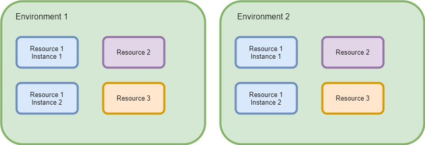

Title: Environments - What and why?
ShowInNavbar: false
---

# Environments

An important part of creating a build pipeline is to define which resources are part of the
build environment. In order to do that it is important to understand what is meant with the term
`environment` as it refers to the resources in Calvinverse.

  > An **environment** is a collection of resource instances and services that work together
  > to achieve one or more goals, i.e. in this case to provide the ability to build, test and
  > release software.

There are several reasons to place resource instances and services inside an environment

* An environment forms a unit of separation between different services that do not need to contact
  each other while still allowing the resources to share an IP pool. This creates the possibility of
  having multiple groups of services, for instance production and a test environment.
* Resources inside an environment are referred to by a name that is unique only inside the
  environment. Two instances of a specific resource that live in different environments will be
  known, in each environment, by the same name. This means that tooling and services can be used
  in all environments without requiring any changes, thus enabling interchangability of services
  between environments, e.g. between a test and production environment.

It should be noted that there are no immediate restrictions that stop services from contacting
resources in a different environment, i.e. environments are a cooperative system. In order to
actually block resources and services from reaching outside the environment additional networking
restrictions need to be provided by routers and firewalls.

An environment should have the following characteristics

* A way to group resources. A resource should 'know' which environment it belongs to. Note that
  'knowing' the environment basically means that a resource should easily be able to contact other
  resources in the environment while making it difficult to contact resources outside the
  environment. To a resource the environment should be the only thing around.
* One or more ways to push information into an environment. An environment isn't very useful if
  it cannot be provided with information in some way.
* One or more ways to get information out of an environment. As with inputs an environment is not
  very useful if no information can leave the environment.

Calvinverse creates environments by using [Consul](https://consul.io) to create environments by
using the [datacenter](https://www.consul.io/docs/glossary.html#datacenter) concept to define an
environment. All services in a datacenter can communicate with each other either by using Consul as
the [DNS](https://www.consul.io/docs/agent/dns.html) resolver or by using more advanced
[Connect](https://www.consul.io/docs/connect/index.html) feature
